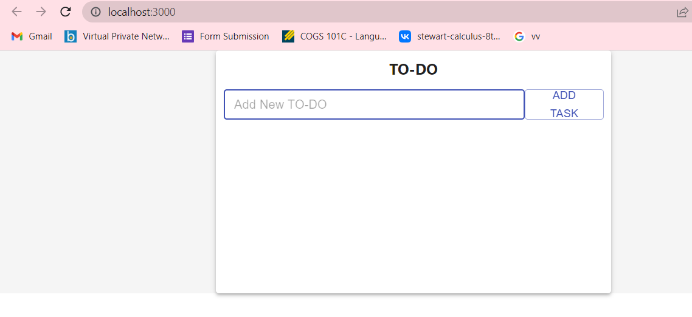
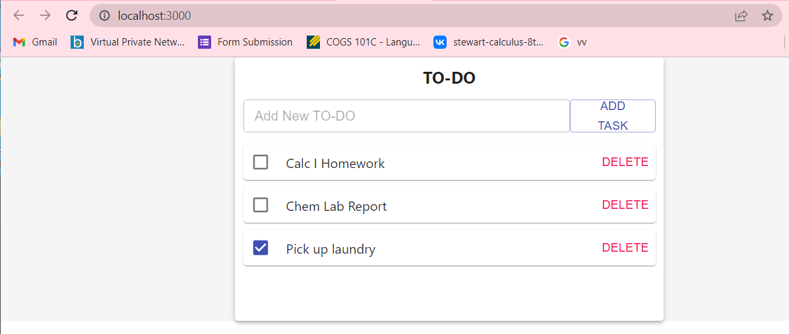

# To-Do App
## A Basic Web App To-Do List.

Our to-do list functionality will be simple-- users will be able to add and delete tasks from the list. 

In this project we will be using Node and Mongoose/Mongodb for the backend, and React and CSS for the front end. 

In order to run the server, use the following command from the server directory (Windows): 
```
node index.js
```
In order to run the front end, use the following command in a separate terminal from the client directory (Windows):
```
npm start
```
Note: Be sure to edit lines 3 and 4 in ./server/db.js to include your own mongodb username and password.

What the app should look like in browser when first ran:


What the app should look like in browser with items added to list:



